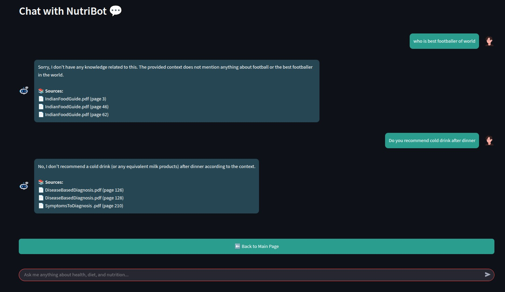

# Hallucination Resistant AI Nutritionist
It is a research-driven, AI-powered nutrition assistant developed under the guidance of **Dr. Ganesh Bagler** at the **Complex Systems Laboratory (IIIT-Delhi)**. It serves as a **one-stop platform** for intelligent nutritional support through **visual meal analysis**, **personalized diet planning**, and **hallucination-free dietary question answering**.

---

## 🚀 Core Features

### 🔍 Retrieval-Augmented Generation (RAG) Powered Nutrition Q&A
- Built with **LangChain**, **FAISS**, and **LLaMA3 (8B)**.
- Curated PDF documents (e.g., Indian food guidelines, diagnosis protocols) are:
  - Chunked intelligently.
  - Embedded using **HuggingFace's all-MiniLM-L6-v2**.
  - Stored into **FAISS vector database** for similarity search.
- Ensures **reliable, grounded answers** to health and nutrition queries—**mitigating LLM hallucinations**.

### 🖼️ Gemini Vision for Meal Image Analysis
- Integrated **Gemini-Flash-1.0 (Vision)** via API to:
  - Analyze meal images uploaded by users.
  - Estimate calories and flag dietary concerns.
- Enables quick, **real-time visual diet assessment**.

### 🧠 Personalized Meal Planning with Qwen 2.5
- Accepts user goals (e.g., weight loss, diabetic diet).
- Generates **personalized and culturally appropriate meal plans**.

---

## 🛠 Tech Stack

| Component | Tech Used |
|----------|-----------|
| Web UI   | Streamlit |
| QnA LLM  | LangChain and Ollama (locally served) |
| Image Analysis | Gemini Flash-1.0 |
| Meal Planning | Qwen 2.5 |
| Vector DB | FAISS |
| Embeddings | HuggingFace (MiniLM) |
| Frameworks | LangChain, Streamlit |

---

## 🧩 Folder Structure

```
NutriBot App/
├── app.py
├── background.html
├── .streamlit/
│   └── secrets.toml
├── chatbot/
│   ├── connectWithLLM.py
│   ├── memoryForLLM.py
│   ├── requirements.txt
│   ├── data/
│   └── vectorstore/
├── requirements.txt
└── README.md
```

---

## 🧪 Installation Instructions

### 🛠️ 1. System Prerequisites

- Python 3.10+
- LLaMA3 (8B) installed locally
- Instructions for LLaMA3 Setup via Ollama

```bash
# 1. Download and install Ollama from:
https://ollama.com/download

# 2. Pull and run LLaMA3 8B
ollama pull llama3:8b
ollama run llama3
```

In your LangChain code, import:

```python
from langchain_ollama import OllamaLLM
```

---
- Internet connection for Gemini & Qwen APIs
- Linux server recommended

### 🌱 2. Setup Root Environment

```bash
python3 -m venv venv
source venv/bin/activate
pip install -r requirements.txt
```

#### Root `requirements.txt`

```
streamlit
python-dotenv
openai
Pillow
requests
aiohttp
google-generativeai
```

### 💬 3. Setup Chatbot Module

```bash
cd chatbot
pip install -r requirements.txt
```

#### Chatbot `requirements.txt`

```
langchain
langchain_community
langchain_huggingface 
faiss-cpu
sentence-transformers
dotenv
```

---

## 🔐 Secrets & API Keys

Create a file at `.streamlit/secrets.toml` and include the following:

```toml
[api_keys]
GEMINI_API_KEY = "your_gemini_api_key"
QWEN_API_KEY = "your_qwen_api_key"
```

---

## 🎮 Running the App

```bash
streamlit run app.py
```

Then visit: [http://localhost:8501](http://localhost:8501)

---
## 📸 Sample Output

NutriBot leveraging FAISS-based vector search to retrieve accurate context for user queries.



## 🧠 Credits

- **Dr. Ganesh Bagler** – Project Supervisor, CoSyLab
- **Shreyas Gore** – Developer, M.Tech CSE

---

## 📎 License

For research and academic use under IIIT-Delhi guidelines. All Rights Reserved with @CoSyLab, RnD Block, IIIT Delhi

